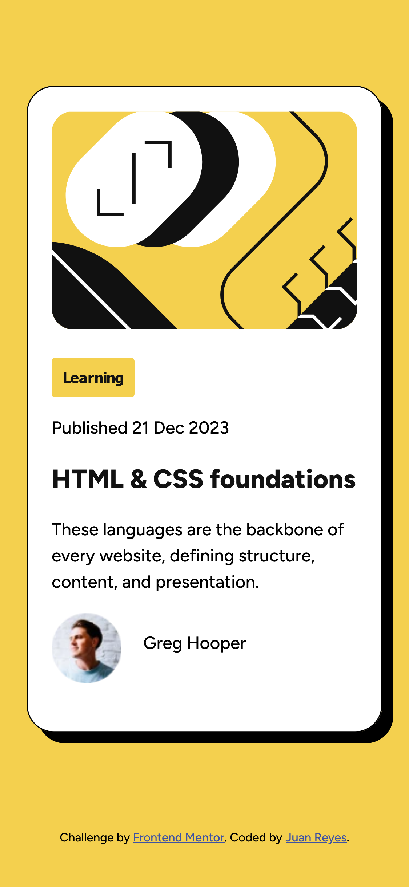

# Frontend Mentor - Blog preview card


## Deploying your project

As mentioned above, there are many ways to host your project for free. Our recommend hosts are:

- [GitHub Pages](https://pages.github.com/)
- [Vercel](https://vercel.com/)
- [Netlify](https://www.netlify.com/)

## Create a custom `README.md`

We strongly recommend overwriting this `README.md` with a custom one. We've provided a template inside the [`README-template.md`](./README-template.md) file in this starter code.

The template provides a guide for what to add. A custom `README` will help you explain your project and reflect on your learnings. Please feel free to edit our template as much as you like.

Once you've added your information to the template, delete this file and rename the `README-template.md` file to `README.md`. That will make it show up as your repository's README file.

# Frontend Mentor - Blog preview card solution

This is a solution to the [Blog preview card challenge on Frontend Mentor](https://www.frontendmentor.io/challenges/blog-preview-card-ckPaj01IcS). Frontend Mentor challenges help you improve your coding skills by building realistic projects. 

## Table of contents

- [Overview](#overview)
  - [Screenshot](#screenshot)
  - [Links](#links)
- [My process](#my-process)
  - [Built with](#built-with)
  - [What I learned](#what-i-learned)
- [Author](#author)
  
  
  


## Overview

Se trata de una sencilla card, con dos imagenes, una de perfil y otra del sitio a visitar.

Se incorcora un estado hover, cuando pasamos el mouse sobre 
el h1. Cambiando el color de negro a amarillo.

### Screenshot



### Links

- Solution URL: [Add solution URL here](https://github.com/juan-mentor/blog-preview-card-main.git)
- Live Site URL: [Add live site URL here](https://juan-mentor.github.io/blog-preview-card-main/)

## My process

- Una vez descargado el proyecto, me lo dibujo en una hoja de papel y coloco todos los contenedores necesarios para estructurar mi desafio. Le doy width, height, margin, border y padding a cada elemento HTML.

- Observo las diferencias entre el diseño desktop y el mobile, para anticipar el tipo de tecnica de diseño a aplicar (flex, grid, etc).

- Escribo el HTML y le pongo clases con el método BEM.

- Escribo el Css selector a selector, desde lo más general a más particular. Cuando termino miro que cambios debo hacer para el estado hover de mis elementos.

### Built with

- Semantic HTML5 markup
- CSS custom properties
- Flexbox
- Mobile-first workflow

### What I learned

He aprendido que cuando una imagen tiene un aspect-ratio determinado y le obligas a romper esa proporción, en mi caso era 1:1 y la altura quería que fuera bastante menor. La propiedad border-radius no se visualiza. Para que el navegador la renderice necesita de la propiedad objet-fit.

```css
.card__image {
    border-radius: 20px;
    object-fit: cover;
}  
```
## Author

)
- Frontend Mentor - [@yourusername](https://www.frontendmentor.io/profile/juanmentor)
